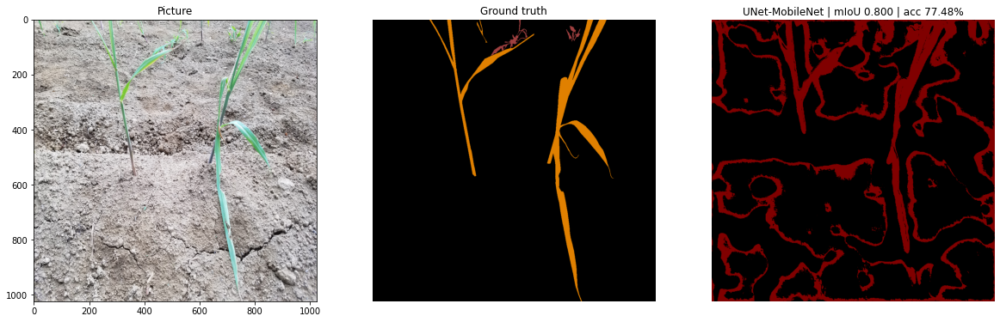
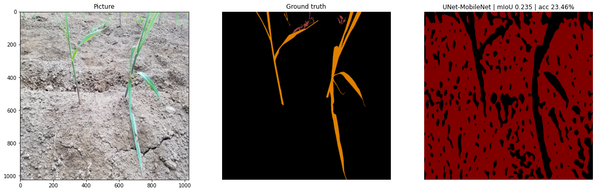
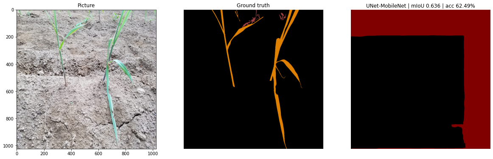
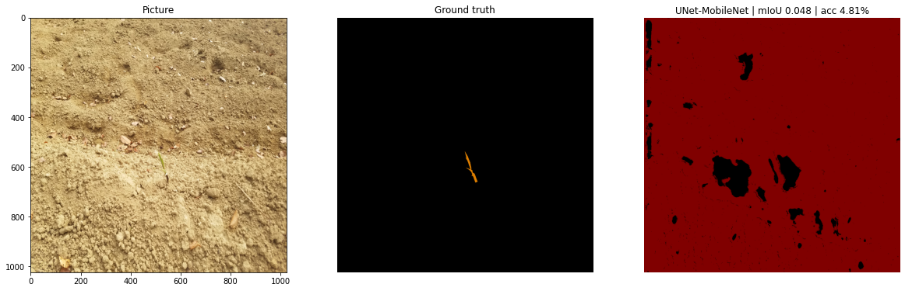
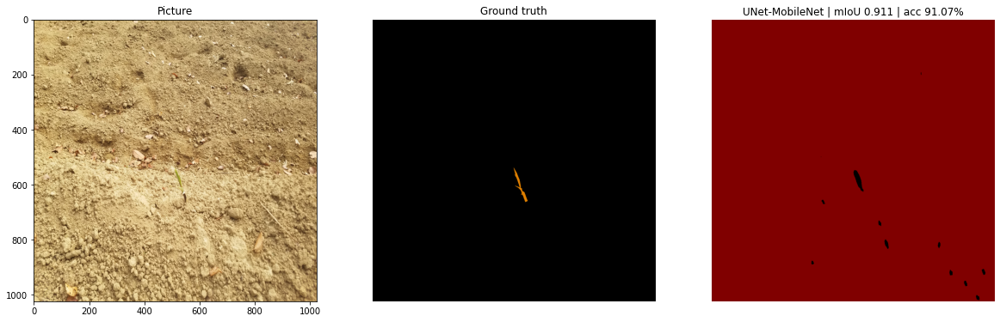
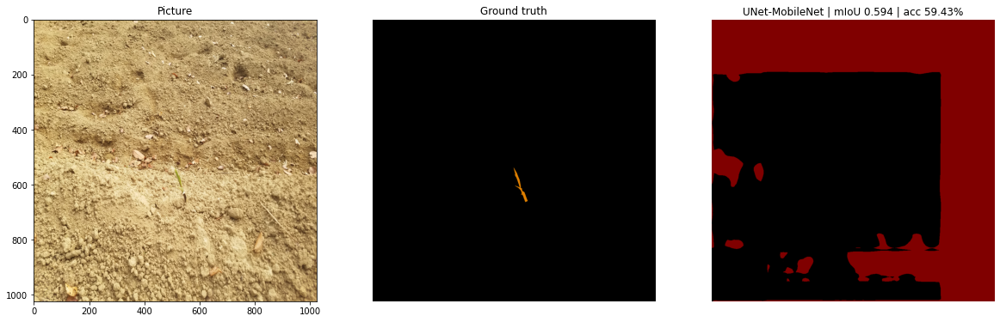

## モデルの性能の比較

各モデルごとに作った推論モデルの比較。
サトウキビが大きく映っている画像と、小さく映っている画像を推論モデルごとに保存しています。

### 大きく映っている画像

- Unet

- Unet++

- PSPNet

- DeepLabV3

- DeepLabV3+

### 小さく映っている画像

- Unet

- Unet++

- PSPNet

- DeepLabV3

- DeepLabV3+
